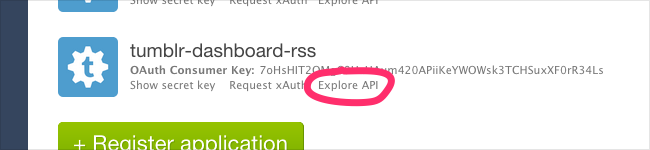

# Well, well, well, what have we here…

This thing that I have made turns different sites’ authenticated feed APIs into RSS feeds on a per-site bases. It’s built with Heroku in mind, but it should run on just about anything. Only Tumblr and Flickr are supported for now.

My motivation is twofold.

1. Internet Creators have built these beautiful Things, but instead of helping these Things mature and age gracefully, they’ve been under pressure to Monetise and Stay Relevant and Appeal To The Teens. These Things that drew me in with their elegance and simplicity have become a mess of Apps and Engagement Bullshit.

  This is an opinionated step in the other direction.
2. Tumblr retains no read status and I follow a lot of people on Tumblr, which means I end up missing out on a lot of great stuff. RSS readers were built to solve this problem, but Tumblr lacks a private dashboard RSS feed, so I had to build my one.

# How do I do the thing

1. Get authentication tokens for whatever services you plan on using.
2. Save them in your local or remote environment so that this thing can use ’em.

## Tumblr

The easiest way to get required Tumblr auth tokens is to click “Explore API” on the [Tumblr app index page][tumblr-app-index] after you’ve generated a new application.



That’ll take you to a developer console with your generated user tokens prefilled. Handy!

Here are the environmental variables you’ll need to set:

```sh
TUMBLR_CONSUMER_KEY
TUMBLR_CONSUMER_SECRET
TUMBLR_TOKEN
TUMBLR_TOKEN_SECRET
```

## Flickr

Fire up this thing and visit `/flickr-photostream.rss`, then check your terminal. It’ll probably say something about authentication. Go to the URL it wants you to visit, approve the thing, then do all the other stuff it wants you to do. Copy the tokens it outputs and add them to your environment.

You’ll need to set the following environmental variables:

```sh
FLICKR_API_KEY
FLICKR_API_SECRET
FLICKR_ACCESS_TOKEN
FLICKR_ACCESS_TOKEN_SECRET
```

# Configuratin’

Once you’ve got your auth tokens, set your environment variables. This is what that looks like for Heroku:

```sh
heroku config:set ENV_VARIABLE_NAME=value
```

If you want to run this biz locally (and you do), make a `.env` file in the root of this folder with your environmental variables set. Should look a little something like this:

```sh
ENV_VARIABLE_NAME=value
```

Once everything’s up and running, your RSS feeds will be available at `http://localhost:6969`. Check the terminal output for the different URLs you can visit.

# TODO

## Features
* Use web-based auth flows to output auth tokens (should be pretty straightforward)

## Additional Feeds
* Instagram (?)

---

Questions/problems? File an issue and/or bug me [on Twitter][@meyer].

[tumblr-app-index]:https://www.tumblr.com/oauth/apps
[@meyer]: http://twitter.com/meyer
